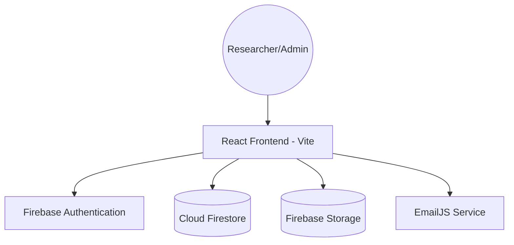
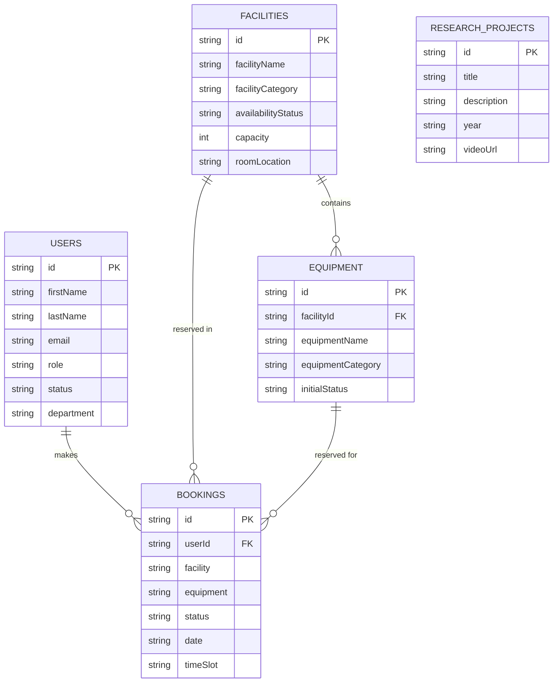
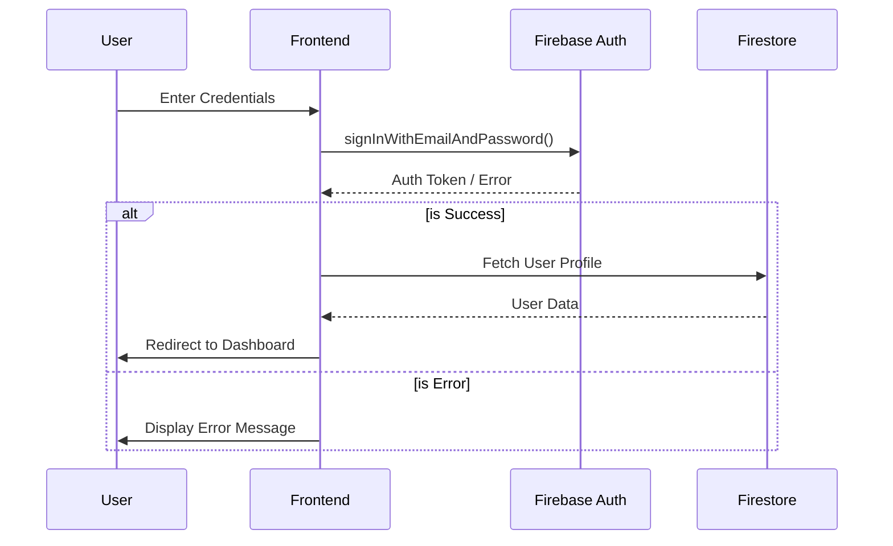

# 🔬 Mahendra R&D Hub: Lab Inventory & Facility Management


**Live Demo**: [https://college-inventory-management-one.vercel.app/](https://college-inventory-management-one.vercel.app/)

A premium, state-of-the-art laboratory management system designed for the **Mahendra R&D Center**. This platform streamlines the process of discovering research facilities, checking equipment availability, and managing laboratory bookings for researchers and administrators with a focus on efficiency and modern aesthetics.

---

## 🚀 Features

### 🧪 For Researchers
- **Facility Discovery**: Browse through categorized research areas (Chemistry, Biomedical, EEE, ECE, Physics, Computer Science, Mechanical).
- **Equipment Catalog**: Real-time status tracking of research instruments (Available, In Use, Maintenance).
- **Smart Booking System**: Seamless reservation flow for labs and equipment with instant validation.
- **Research Outcomes**: Showcase and view successful research projects and outcomes.
- **Personal Dashboard**: Track past and upcoming bookings with status updates.

### 🛡️ For Administrators
- **Executive Dashboard**: High-level overview of bookings, pending approvals, and resource counts.
- **Resource Management**: Full CRUD operations for laboratories and instruments.
- **Request Workflow**: centralized system to approve or reject booking requests.
- **Self-Healing Database**: Integrated "Auto-Seed" technology that restores core data if the database is detected as empty.
- **User Management**: Monitor and manage researcher profiles and access status.

---

## 🛠️ Tech Stack

- **Frontend**: [React 19](https://react.dev/) + [Vite](https://vitejs.dev/)
- **Styling**: [Tailwind CSS](https://tailwindcss.com/) + Modern CSS Glassmorphism
- **State Management**: React Context API with persistent Firestore synchronization
- **Backend/Database**: [Firebase Firestore](https://firebase.google.com/docs/firestore)
- **Authentication**: [Firebase Authentication](https://firebase.google.com/docs/auth)
- **Storage**: [Firebase Storage](https://firebase.google.com/docs/storage)
- **Notifications**: [EmailJS](https://www.emailjs.com/) for automated booking alerts
- **Visuals**: [Lucide React](https://lucide.dev/) (Icons), [Recharts](https://recharts.org/) (Analytics), [Framer Motion](https://www.framer.com/motion/) (Animations)

---

## 🏗️ System Architecture



---

## 📊 Database Schema



---

## 🔐 Authentication Flow



---

## 📁 Project Structure

```text
├── assets/             # Build artifacts and static assets
├── docs/               # Project documentation and images
├── public/             # Public static assets
├── src/
│   ├── app/
│   │   ├── components/ # Reusable UI components (Sidebar, Navbar, Layout)
│   │   ├── context/    # Global state (AppContext.tsx)
│   │   ├── data/       # Static data and category definitions
│   │   ├── pages/      # Route pages (Home, Admin, Bookings, etc.)
│   │   ├── services/   # Firebase & Firestore logic (seed, CRUD)
│   │   ├── utils/      # Helper functions (image processing)
│   │   └── routes.tsx  # Application routing configuration
│   ├── styles/         # Global styles and Tailwind configuration
│   ├── firebase.ts     # Firebase initialization
│   └── main.tsx        # Application entry point
├── firestore.rules     # Database security rules
├── vercel.json         # Vercel deployment configuration
└── vite.config.ts      # Vite configuration
```

---

## ⚙️ Installation

### Prerequisites
- Node.js (v18 or higher)
- npm or pnpm
- Firebase Account

### Step-by-Step Setup

1. **Clone the repository**
   ```bash
   git clone https://github.com/rajkrish63/College-inventory-management.git
   cd College-inventory-management
   ```

2. **Install dependencies**
   ```bash
   npm install
   ```

3. **Configure Environment Variables**
   Create a `.env` file in the root directory:
   ```env
   VITE_FIREBASE_API_KEY=your_api_key
   VITE_FIREBASE_AUTH_DOMAIN=your_auth_domain
   VITE_FIREBASE_PROJECT_ID=your_project_id
   VITE_FIREBASE_STORAGE_BUCKET=your_storage_bucket
   VITE_FIREBASE_MESSAGING_SENDER_ID=your_sender_id
   VITE_FIREBASE_APP_ID=your_app_id
   ```

4. **Run the application**
   ```bash
   npm run dev
   ```

---

## 💡 Usage

### For Researchers
1. **Sign Up / Login**: Create an account and verify your email.
2. **Explore**: Navigate to 'Facilities' or 'Equipment' to view available resources.
3. **Book**: Select a resource, choose a date and time slot, and submit your request.
4. **Monitor**: Check 'My Bookings' to see the approval status of your requests.

### For Administrators
1. **Admin Login**: Access using designated administrator credentials.
2. **Manage Requests**: Review pending bookings in the Admin Dashboard and Approve/Reject.
3. **Update Inventory**: Add new facilities or equipment through the 'Add Resource' interface.
4. **System Health**: Monitor user activity and ensure resource status is accurate.

---

## 📸 Screenshots


*Home Page Dashboard*


*Facility Exploration View*


*Resource Booking Interface*


*Administrator Management Panel*

---

## 🔌 API Endpoints (Firestore Collections)

| Collection | Description | Access Level |
|------------|-------------|--------------|
| `facilities` | Stores laboratory details and availability | Public Read / Admin Write |
| `equipment` | Sub-collection of facilities storing instrument data | Public Read / Admin Write |
| `bookings` | Stores all reservation requests and statuses | User Read-Own / Admin Read-Write |
| `users` | User profiles and role management | User Read-Own / Admin Read-Write |
| `researchProjects` | Outcomes and showcase projects | Public Read / Admin Write |

---

## 🌍 Environment Variables

| Variable | Description |
|----------|-------------|
| `VITE_FIREBASE_API_KEY` | Firebase project API key |
| `VITE_FIREBASE_AUTH_DOMAIN` | Firebase Auth domain |
| `VITE_FIREBASE_PROJECT_ID` | unique Firebase project ID |
| `VITE_FIREBASE_STORAGE_BUCKET` | Cloud Storage bucket URL |
| `VITE_FIREBASE_MESSAGING_SENDER_ID` | Cloud Messaging ID |
| `VITE_FIREBASE_APP_ID` | unique Firebase Application ID |

---

## 🚢 Deployment

### Vercel (Frontend)
The project is optimized for Vercel. Ensure `vercel.json` is present to handle SPA routing:
```json
{
  "rewrites": [{ "source": "/(.*)", "destination": "/index.html" }]
}
```

### Firebase (Backend)
Deploy Firestore rules to secure your data:
```bash
firebase deploy --only firestore:rules
```

---

## 🔮 Future Improvements

- [ ] **AI-Powered Scheduling**: Optimize lab usage based on historical booking patterns.
- [ ] **Mobile Application**: Dedicated React Native app for on-the-go bookings.
- [ ] **QR Code Integration**: Scan equipment in the lab for instant status checks and manuals.
- [ ] **ERP Integration**: Link with institutional financial systems for consumables tracking.
- [ ] **Real-time Chat**: Integrated communication between researchers and lab managers.

---

## 🤝 Contributing

1. Fork the Project
2. Create your Feature Branch (`git checkout -b feature/AmazingFeature`)
3. Commit your Changes (`git commit -m 'Add some AmazingFeature'`)
4. Push to the Branch (`git checkout origin feature/AmazingFeature`)
5. Open a Pull Request

---

## 📄 License

Distributed under the MIT License. See `LICENSE` for more information.

---

## ✍️ Author

**Name**: [Your Name]
**GitHub**: [rajkrish63](https://github.com/rajkrish63)
**LinkedIn**: [Your LinkedIn]

---
Designed for the **Mahendra Research & Development Center**.
